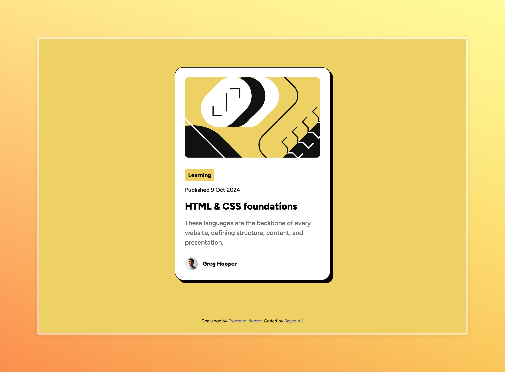

# Frontend Mentor - Blog preview card solution

This is a solution to the [Blog preview card challenge on Frontend Mentor](https://www.frontendmentor.io/challenges/blog-preview-card-ckPaj01IcS). Frontend Mentor challenges help you improve your coding skills by building realistic projects.

- Solution [GitHub]()
- Live Site on [Netlify]()

## What I learned

`<time>` is the HTML Time element. It allows you to display time in a human-readable format, while providing a machine readable format using the `datetime` attribute.

`clamp()` is a CSS function that can be used to provide some sort of responsive behavior. I used it to dynamically change the font size based on the viewport width, while limiting the minimum and maximum size.

## Code Design

I noticed I picked a particular pattern, following the design system provided for this project. I could have targetted the elements using the semantic classes I had provided, and applied the font styles directly. Instead, I grouped all the styles for each font preset under an appropriate class name, and added them to the HTML elements.
